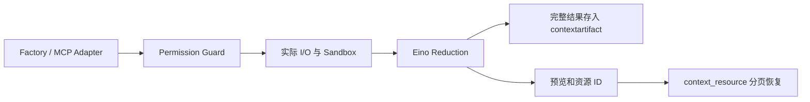

# Tools：能力注册、授权和 Eino Reduction

[总目录](../../docs/architecture/README.md) · [内置工具](builtin/README.md) · [Permission](../permission/README.md)

`Registry.Resolve` 根据冻结的 Scope 构造工具。Scope 的 Agent、Session、工作区与安全策略来自 Runtime，模型参数不能修改这些身份。所有 Builtin 与 MCP 工具进入同一套 Permission Guard，Ask 通过 Eino interrupt/checkpoint 恢复原调用，不接受前端重新提供参数。

`guarded_tool.go` 只管理授权；`reduction.go` 负责所有工具结果的归档与清理。单个长结果先保存全文再返回预览；累计上下文到阈值后由 Eino 清理旧轮次。`ClearAtLeastTokens` 启用 Eino 的副本改写，原始消息和工具参数不被修改。`skill` 与 `context_resource` 不被递归归档。

没有独立的 ResultBudget、恢复额度池或自定义 ToolCallID context key。ToolCallID 直接使用 `compose.GetToolCallID`。未知工具配置直接报错，不保留旧 delegation 工具名称的兼容分支。

| 文件 | 职责 |
| --- | --- |
| `registry.go` | 注册、能力选择、冻结工具与关闭 |
| `types.go` | Factory、Descriptor、Scope 契约 |
| `guarded_tool.go`、`permission.go` | 授权与审批恢复 |
| `capability_identity.go` | 授权规则匹配所需身份 |
| `reduction.go` | Eino 与会话归档资源协议之间的适配 |

文件工具的 schema、解析和显示由 Eino filesystem 提供；`builtin/filesystem.go` 实现受限 Backend，保留 PathGuard、os.Root、UTF-8、大小限制和原子写入。`apply_patch`、移动/复制/删除、命令沙箱仍是独立产品能力，不能用普通读写工具替代其行为。
