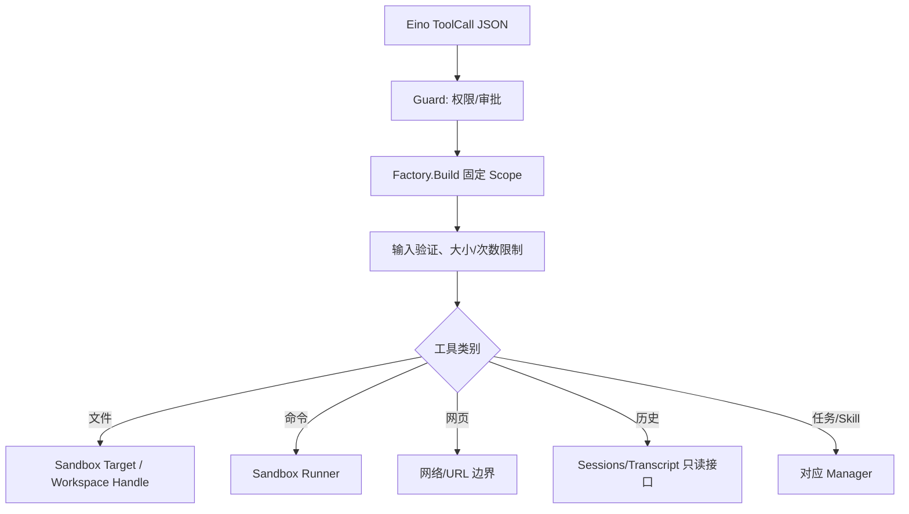

# Builtin Tools：具体动作实现

[总目录](../../../docs/architecture/README.md) · [Tool Registry](../README.md)

本目录负责具体的文件、网页、系统与会话动作。每个 Factory 的 `Descriptor` 告诉 Registry 如何暴露；`Build(ctx, scope)` 固定本轮依赖；`run` 对模型输入做校验并执行。工具可被 Agent 选择，但真正调用还会经过 Registry 的 Guard、Permission 和各自的 Sandbox/Workspace 校验。

| 功能 | 文件 | 实现入口与要点 |
| --- | --- | --- |
| 文件浏览/读取/查找 | `list_files.go`、`read_file.go`、`search_files.go` | `openSandboxTarget` 后按相对路径访问，遍历和输出受限。 |
| 文件修改 | `write_file.go`、`edit_file.go`、`apply_patch.go`、`file_ops.go` | 检查写入范围和文件大小；写入结果进入 Transcript 的工具事务。 |
| 命令与 Git | `run_command.go`、`run_skill_script.go`、`git_tools.go` | 受命令配置、工作区、Sandbox Runner、时间和输出上限约束。 |
| 文档 | `extract_document.go` | 从附件 ID 或允许路径读取，调用 `documenttext.Extract` 得到 Markdown，再按 offset/limit 返回。 |
| 历史和大内容 | `context_history.go`、`context_artifact.go` | `session_history` 搜索/回读旧 Entry；`context_resource` 分段读附件或归档结果。 |
| 网页 | `websearch_tool.go`、`websearch_backends.go`、`webfetch_tool.go`、`browser_tool.go` | 搜索/抓取与 Chrome CDP 操作分别实现；网络目标与内容长度受限。 |
| 扩展与系统 | `install_skill.go`、`collaboration_tools.go`、`schedule_task.go`、`system_tools.go` | 调用 Skill、子 Agent、Task Manager 或提供时间/计划辅助。 |

`browser_tool.go` 启动独立配置的可见 Chrome 窗口，用户与 Agent 共用一页；每个 Agent 的配置保存在 cache/browser-profiles，Cookie 跨应用重启保留，其他 Agent 无法复用。CDP 负责交互，截图以原始 PNG 保存到当前会话的 attachments 并显示在聊天中，返回附件 ID。`copy_file` 可将当前会话附件复制到 Sandbox 允许的目标路径，因此保存或重命名截图无需在 browser 工具中处理。检测到网站验证页时只返回 `needs_human_verification`，交由用户在窗口中手动完成，工具不会自动操作验证控件。它没有桌面级操作能力。`webfetch_tool.go` 的网页正文是外部不可信内容；`htmlmarkdown.go` 只是格式转换。`run_command.go` 不应通过拼接字符串绕开 Sandbox Runner。`sandbox_fs.go` 是多个文件工具共享的路径入口；新增文件操作应优先复用它。

`glob_files` 递归查找文件名，`list_files` 列目录。`run_command` 可执行 PATH 中的程序，拒绝明显的删除参数；强制只读的原生沙箱保护工作区，即使程序通过解释器或子进程写入也是如此。每次调用有独立临时目录。会话或 Agent 长期允许绑定完整 argv、工作目录与超时的指纹，参数变化后重新审批；权限 Allow 仍不能突破沙箱。

调试一个工具：先从 `app/tools.go` 找注册名，再看本文件 Factory 的 `Descriptor`/`Build`/`run`，最后查 `GuardInvokableTool` 与 `runtime.Executor` 的 Tool Started/Completed 事件和对应 JSONL ToolResult。

## 新工具的实现清单

以文件写入为例，`Descriptor` 应声明稳定名称、能力身份与风险；`Build` 只接收受控 Scope；`run` 校验 JSON 参数、调用 `openSandboxTarget`/`CheckPath` 后执行文件操作，并返回长度受限的结构化结果。Registry 的 Guard 提供审批，但不会替工具做文件系统层面的最终检查。对于命令或 Skill 脚本则调用 `sandbox.Runner`；对于网络工具则在真实连接前校验目标地址。

旧历史和大内容回查是只读工具：`session_history` 通过 ActiveBranch 索引搜索或按 Entry ID 读取，不把整个 JSONL 放进提示词；`context_resource` 用 ID、offset、limit 读取附件或 ContextArtifact。`extract_document` 从附件或受控路径取原件，调用 `documenttext` 转 Markdown 后分段返回。这样的工具让 Agent 按需拿细节，而不必在每轮自动装入完整文档。
