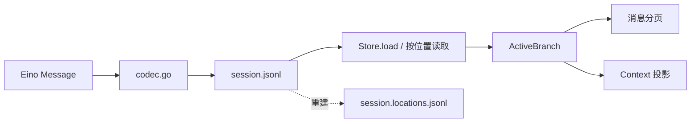
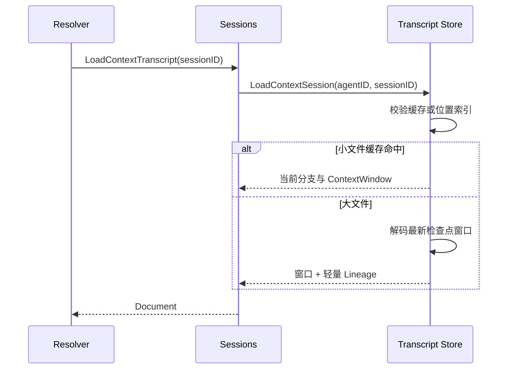

# Transcript：会话消息事实与索引

[总目录](../../docs/architecture/README.md) · [会话](../sessions/README.md) · [上下文](../contextengine/README.md)

## 职责与数据模型

本包定义长期磁盘协议，不能把 Eino `schema.Message` 直接当作 JSONL 格式。`types.go` 的 `SessionHeader` 是第一行；其后每个 `Entry` 有稳定 `id`、`parentId` 和时间戳。普通聊天使用 `message`，压缩使用 `compaction`。`AgentMessage` 的有序 `ContentBlock` 区分 text、image、file、thinking、toolCall；工具结果使用 `toolResult` 角色。`codec.go` 在 Eino 与 Wire 格式之间转换。



JSONL 的物理行序不等于模型历史：`loadLocked` 建立 `entryByID`，`buildActiveBranch` 从当前 Leaf 沿 `parentId` 反向回溯。被放弃的分支仍留在文件中，但不进入当前模型上下文。`Document.Entries` 是完整节点集合，`ActiveBranch` 是当前分支。大文件的 `Lineage` 只保留轻量身份，用于 Memory cursor 校验。

## 写入、读取与恢复

1. `Store.CreateSession` 写 Header，`AppendMessage` 与 `AppendCompaction` 走 `appendEntry`。同一个文件由 per-path 锁串行写入；追加后递增更新缓存/位置索引。
2. `LoadSession` 返回完整历史；`LoadContextSession` 面向模型窗口；`LoadMessagePage` 面向 UI 分页。不要为了构造 Context 调用完整历史接口。
3. 小文件使用 `cache.go` 的有界 Document 缓存。超过缓存阈值后，`location_index.go` 保存每条 Entry 的字节范围、分支元数据和消息位置；正常读取只解码所需窗口或页。
4. Sidecar 根据源文件身份、大小和修改时间验证。缺失或失效时 `scanLocationIndex` 扫描原始 JSONL 并重建。索引可删，JSONL 不可删。
5. `repairTailLocked` 只处理可安全识别的尾部损坏；结构化损坏会报错，不猜测中间历史。`validateCompactionAgainstDocument` 在追加检查点时核对当前分支与切点，防止摘要挂到错误分支。



## 关键代码与调试

| 文件 | 阅读重点 |
| --- | --- |
| `types.go` | `Entry`、`AgentMessage`、`Document`、`ContextWindowIndex` 的磁盘/内存边界。 |
| `store.go` | 创建、追加、严格校验、ActiveBranch 和尾部修复。 |
| `codec.go` | thinking、工具调用、工具结果、附件引用如何往返 Eino。 |
| `location_index.go`、`cache.go` | 长会话按字节定位与小会话 LRU；索引失效重建。 |
| `history_index.go` | `session_history` 所需的逆序遍历与局部范围读取。 |
| `tool_result.go`、`artifacts.go` | 工具结果及文件效果的确定性提取。 |

追踪一条消息时记录 `sessionID`、`Entry.ID`、`ParentID`：先在 `AppendMessage` 看写入，再在 `LoadMessagePage` 看 UI 读取，最后在 `projectActiveBranch` 看模型可见形式。相关测试在本包 `*_test.go`；更高层读取由 `sessions.Service` 测试覆盖。

## 用一个分支例子读代码

下面是示意节点关系（不是完整 JSONL schema）：

```text
header
u1 → a1 → u2 → a2 → c1(compaction, firstKeptEntryId=u2) → u3
           ↘ a1-retry（另一个分支，当前 Leaf 不指向它）
```

`buildActiveBranch` 只沿当前 Leaf 的 parent 链取节点，因此另一分支的 `a1-retry` 不会进入 Context。`ContextWindowIndex` 可直接指向 `c1` 与 `u2`；`projectActiveBranch` 再把 `c1.Summary + u2/a2/u3` 投影为模型消息。`history_index.go` 仍能按 Entry ID 找旧节点。若新增 Entry 导致 Leaf 改变，旧的压缩计划在 `validateCompactionAgainstDocument` 阶段被拒绝。

修改 Wire 字段时应按 `types.go → codec.go → store.go 校验 → location_index.go` 的顺序检查；索引字段可以重建，JSONL 字段却必须兼容旧用户数据。有关读取成本，看 `ReadStats.BytesRead` 和 `IndexRebuilt`，不要只看会话文件总大小。
