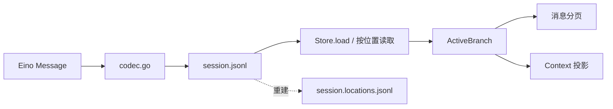
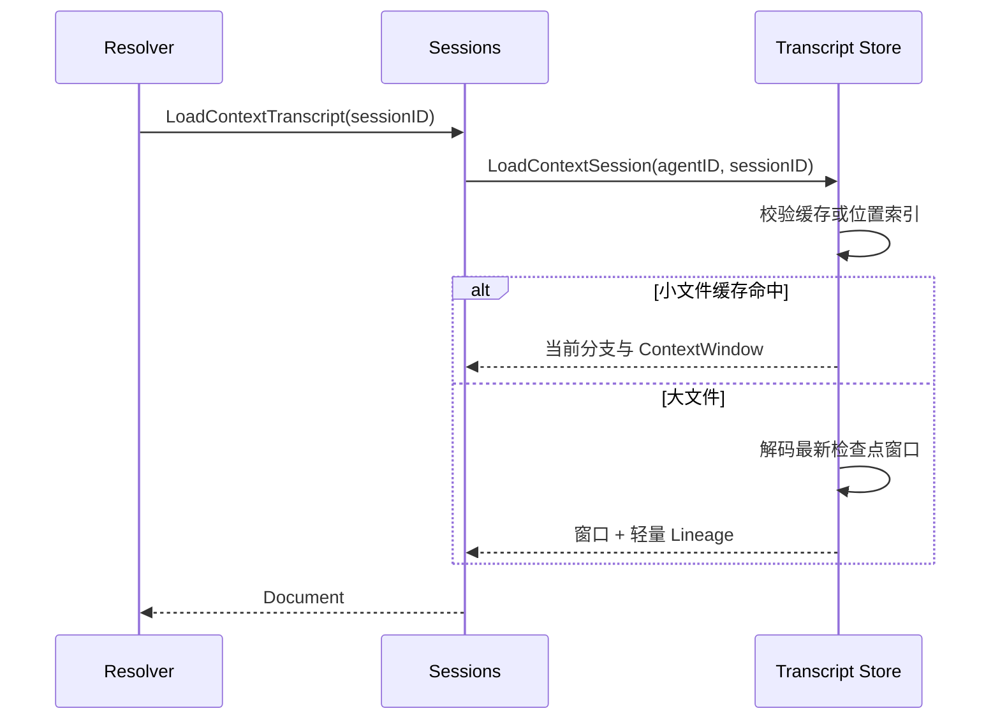

# Transcript：会话消息事实与索引

[总目录](../../docs/项目源码详解.md) · [会话](../sessions/README.md) · [上下文](../contextengine/README.md)

## 职责与数据模型

本包定义长期磁盘协议，不能把 Eino `schema.Message` 直接当作 JSONL 格式。`types.go` 的 `SessionHeader` 是第一行；其后每个 `Entry` 有稳定 `id`、`parentId` 和时间戳。普通聊天使用 `message`，压缩使用 `compaction`。`AgentMessage` 的有序 `ContentBlock` 区分 text、image、file、thinking、toolCall；工具结果使用 `toolResult` 角色。`codec.go` 在 Eino 与 Wire 格式之间转换。


```mermaid
flowchart LR
  E[Eino Message] --> C[codec.go] --> J[session.jsonl]
  J --> S[Store.load / 按位置读取] --> B[ActiveBranch]
  B --> P[消息分页]
  B --> X[Context 投影]
  J -.重建.-> I[session.locations.jsonl]
```

JSONL 的物理行序不等于模型历史：`loadLocked` 建立 `entryByID`，`buildActiveBranch` 从当前 Leaf 沿 `parentId` 反向回溯。被放弃的分支仍留在文件中，但不进入当前模型上下文。`Document.Entries` 是完整节点集合，`ActiveBranch` 是当前分支。大文件的 `Lineage` 只保留轻量身份，用于分支身份和来源校验。

## 写入、读取与恢复

1. `Store.CreateSession` 写 Header，`AppendMessage` 与 `AppendCompaction` 走 `appendEntry`。同一个文件由 per-path 锁串行写入；追加后递增更新缓存/位置索引。
2. `LoadSession` 返回完整历史；`LoadContextSession` 面向模型窗口；`LoadMessagePage` 面向 UI 分页。不要为了构造 Context 调用完整历史接口。
3. 小文件使用 `cache.go` 的有界 Document 缓存。超过缓存阈值后，`location_index.go` 保存每条 Entry 的字节范围、分支元数据和消息位置；正常读取只解码所需窗口或页。
4. Sidecar 根据源文件身份、大小和修改时间验证。缺失或失效时 `scanLocationIndex` 扫描原始 JSONL 并重建。索引可删，JSONL 不可删。
5. `repairTailLocked` 只处理可安全识别的尾部损坏；结构化损坏会报错，不猜测中间历史。`validateCompactionAgainstDocument` 在追加检查点时核对当前分支与切点，防止摘要挂到错误分支。


```mermaid
sequenceDiagram
  participant R as Resolver
  participant S as Sessions
  participant T as Transcript Store
  R->>S: LoadContextTranscript(sessionID)
  S->>T: LoadContextSession(agentID, sessionID)
  T->>T: 校验缓存或位置索引
  alt 小文件缓存命中
    T-->>S: 当前分支与 ContextWindow
  else 大文件
    T->>T: 解码最新检查点窗口
    T-->>S: 窗口 + 轻量 Lineage
  end
  S-->>R: Document
```

## 关键代码与调试

| 文件 | 阅读重点 |
| --- | --- |
| `types.go` | Wire 字段/枚举、哨兵错误、`CorruptionError` 和消息/节点/Header 校验。 |
| `store.go` | 公开会话 API、文件锁、提交顺序及缓存/索引协调。 |
| `journal.go` | 真实路径检查、JSONL 编解码、严格重放、活动分支构造和断尾恢复。 |
| `codec.go` | thinking、工具调用、工具结果、附件引用如何往返 Eino。 |
| `location_index.go`、`cache.go` | 长会话按字节定位与小会话 LRU；索引失效重建。 |
| `history_index.go` | `session_history` 所需的逆序遍历与局部范围读取。 |
| `tool_result.go` | 工具结果及文件效果的确定性提取。 |

追踪一条消息时记录 `sessionID`、`Entry.ID`、`ParentID`：先在 `AppendMessage` 看写入，再在 `LoadMessagePage` 看 UI 读取，最后在 `projectActiveBranch` 看模型可见形式。相关测试在本包 `*_test.go`；更高层读取由 `sessions.Service` 测试覆盖。

## 用一个分支例子读代码

下面是示意节点关系（不是完整 JSONL schema）：

```text
header
u1 → a1 → u2 → a2 → c1(compaction, firstKeptEntryId=u2) → u3
           ↘ a1-retry（另一个分支，当前 Leaf 不指向它）
```

`buildActiveBranch` 只沿当前 Leaf 的 parent 链取节点，因此另一分支的 `a1-retry` 不会进入 Context。`ContextWindowIndex` 可直接指向 `c1` 与 `u2`；`projectActiveBranch` 再把 `c1.Summary + u2/a2/u3` 投影为模型消息。`history_index.go` 仍能按 Entry ID 找旧节点。若新增 Entry 导致 Leaf 改变，旧的压缩计划在 `validateCompactionAgainstDocument` 阶段被拒绝。

修改 Wire 字段时应按 `types.go 字段/校验 → codec.go → journal.go 重放 → location_index.go` 的顺序检查；索引字段可以重建，JSONL 字段却必须兼容旧用户数据。有关读取成本，看 `ReadStats.BytesRead` 和 `IndexRebuilt`，不要只看会话文件总大小。

## 修改与扩展的归属

Store 持有每个日志路径的锁。`lockExistingSession` 统一完整历史、Context、分页及显式 Repair 的路径生成、加锁和既有文件检查；检查失败立即释放锁，成功后由入口 defer 释放。创建、删除和只读 Header 查询仍使用各自的流程，避免把所有文件操作硬套成同一种锁策略。

`journal.go` 不持有另一套 Manager、缓存或索引。`repairTailLocked`、`loadLocked` 接收已加锁的路径；写入单行后 `Sync` 和 `Close` 仍在 Store 的提交过程中完成。协议自身的合法性在 `types.go` 校验，当前 Leaf 与压缩切点是否仍属于活动分支则在 Store 锁内校验，两类检查不能互相替代。

`location_index.go` 同时提供 `messageEntryPageFromIndex` 与 `contextWindowIndex`，内存缓存和磁盘位置索引共用这些推导规则。分页会向前扩展到完整的 ToolCall/ToolResult 事务；大文件不会为了复用代码改为每页全量重放。

原 `errors.go` 的定义已迁入 `types.go`；旧文件仅保留 package 声明，可手动删除。
