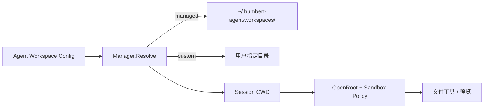

# Workspace：Agent 工作目录与安全文件句柄

[总目录](../../docs/architecture/README.md) · [Sandbox](../sandbox/README.md) · [工作区视图](../workspaceview/README.md)

`Manager` 支持应用管理的 Managed Workspace 和用户选择的 Custom Workspace。`Validate`/`Resolve` 规范化目录并检查归属；Session 创建时把解析后的路径冻结为 CWD。`OpenRoot` 提供受控文件句柄，`NormalizeRelativePath` 防止把模型传入的相对路径直接拼接成越界绝对路径。只有 Managed Workspace 属于应用，可以随 Agent 删除；Custom Workspace 不会被级联物理删除。

`browser.go` 的 `ListDirectory` 与 `PreviewFile` 供右侧文件树/预览使用，限制目录和文件内容，避免把任意二进制当文本。`path.go` 处理相对路径规范化。真正文件工具还要核对 `sandbox.EffectivePolicy.CheckPath`；前端树里看不到某文件不是权限边界。

| 文件 | 关键入口 |
| --- | --- |
| `manager.go` | `ManagedPath`、`Validate`、`Resolve`、`OpenRoot`、`DeleteManaged`。 |
| `path.go` | `NormalizeRelativePath`。 |
| `browser.go` | `ListDirectory`、`PreviewFile`。 |
| `types.go` | Managed/Custom 模式和 Workspace 结构。 |

测试路径问题要覆盖绝对路径、`..`、符号链接、已删除目标、Custom/Managed 所有权。改 Workspace 设置后，旧 Session CWD 不应被默默重写。
